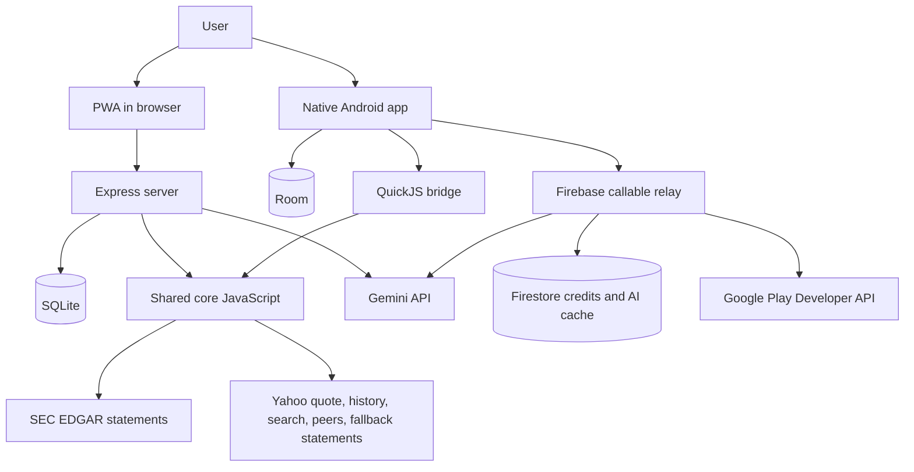

# Runtime and architecture

## System shape

Pocket Omaha is a monorepo with one domain engine and two hosts.

`core/` owns financial ingestion policy, normalization, scoring, alerts, review queue construction, backup reconciliation, prompt construction, and other decisions that must agree across clients. The PWA imports it directly in Node. Android runs generated bundles from `core/dist/` inside QuickJS and supplies HTTP and storage host functions.

Kotlin and server code provide platform services: UI, persistence, networking adapters, scheduling, notifications, files, auth, and billing. They must not reimplement domain decisions already in `core/`.

## Repository components

- `core/` — portable JavaScript domain engine and regression tests.
- `server/` — Express routes, SQLite adapters, invite auth, PWA Web Push, alert worker, and PWA Gemini cache.
- `web/` — single-page PWA, service worker, manifest, styles, generated glossary, and assets.
- `android/app/` — single-activity Compose UI, Android workers, widget configuration, and app integration.
- `android/data/` — Room schema and repositories, Firebase auth/callable client, and Play Billing client.
- `android/design/` — shared native design tokens and explanation UI.
- `android/engine/` — JVM QuickJS host and fast parity tests.
- `android/engine-android/` — Android QuickJS binding and staged engine assets.
- `android/widget/` — Glance rendering surface; it does not open Room itself.
- `functions/src/` — Firebase callable implementation for Android AI credits and purchase verification.
- `design/` — source design tokens used to generate web and Android assets.
- `tools/` and `scripts/` — bundle generation, fixtures, prompt inspection, token/glossary generation, and brand assets.

## Market-data pipeline

For a requested ticker, the engine:

1. Normalizes the symbol.
2. Reads the host cache and decides whether quote and statement tiers remain fresh.
3. Fetches annual/quarterly statements from SEC EDGAR first.
4. Falls back to Yahoo fundamentals when EDGAR has no usable periods or fails.
5. Fetches quote/profile data, monthly price history, search, peers, and spot FX from Yahoo.
6. Normalizes reporting currency separately from trading currency.
7. Builds a model with explicit `null` for unavailable facts.
8. Computes metrics, the 12 checks, five pillars, coverage, composite, DCF inputs, risks, and catalysts.
9. Persists the scored record through the host store.

Quotes are fresh for 15 minutes. Filed statements are fresh for 24 hours. A refresh request bypasses the applicable cache read. Provider failures are typed so a network or rate-limit failure is not mistaken for a nonexistent symbol.

SEC numbers are used as filed. The engine does not substitute a plausible constant for an absent fact. Inapplicable and unreported checks do not contribute to the score. When measured score weight is below 60%, the composite is `null`.

## PWA startup and request flow

At server startup:

1. `.env` is loaded.
2. the SQLite file is opened, WAL and foreign keys are enabled, and additive migrations run;
3. seed watchlists are created only when no list exists;
4. VAPID keys are read from configuration/SQLite or generated and persisted;
5. Express serves the API and PWA shell;
6. the alert worker starts unless `ALERTS_ENABLED=0`.

At browser startup:

1. the PWA registers its service worker;
2. it validates the device session or shows activation;
3. it loads settings and watchlists;
4. it restores the last active watchlist and current ticker from browser-local preferences;
5. it opens Watchlist by default unless a notification/deep link requests another view;
6. live API data replaces loading states; a last-good IndexedDB record can cover a failed stock read.

Static HTML, JavaScript, CSS, the manifest, and icons use explicit cache/update rules. `/api/` is always network only in the service worker. `/bust` clears the service-worker cache escape hatch. A newly activated worker announces an update instead of force-reloading and discarding unsaved form content.

## Android startup and navigation

Android uses one `MainActivity` and Compose state rather than one activity per screen. On launch it:

1. consumes and displays a previously recorded crash trace once, if present;
2. reads ticker or watchlist intent extras from an alert/widget tap;
3. creates notification channels;
4. ensures the unique periodic alert and widget jobs are scheduled;
5. reads the stored theme;
6. constructs the app and shared repository handles;
7. opens the requested destination or Watchlist.

The navigation stack records screen transitions. Back dismisses overlays before popping the stack and ultimately returns to Watchlist. Dialogs and bottom sheets implement outside-tap dismissal.

Room is opened once through `OmahaEngine`. The widget module receives rendered state via Glance storage rather than opening a second database connection.

## Android QuickJS bridge

The Android build bundles the relevant `core/` entry points with esbuild. `:engine-android:stageCoreAssets` copies only `core/dist/` into Android assets. QuickJS calls the same functions the server uses, while Kotlin supplies:

- HTTP through OkHttp;
- current time;
- Room-backed stock, settings, personal-data, snapshots, and alert stores;
- JSON transport at the boundary.

Stock evaluation is intentionally serialized. The current QuickJS binding cannot safely run two live interpreters for concurrent ticker loads. Watchlist loading emits progressive state after each ticker so the user sees completed rows while the rest remain queued.

## Watchlist aggregate

Only companies with a numeric composite contribute. If every scored company has positive market capitalization, the composite and pillar scores are weighted by company size. Otherwise they use equal weights. This is a company-size health summary, not a portfolio return/risk measure. Checklist totals include all successfully loaded companies, while unscored count is reported separately.

## Review queue

The queue is built from watchlist companies, theses, valid review entries, and delivered alert history. Its current priority is recorded changes, 90-day due reviews, thesis setup, first review, then reviewed. It never fetches data merely because the queue is opened on Android. See [Review workflow](18_REVIEW_WORKFLOW.md).

## Alert runtime

Policy lives in `core/alerts/`. Both hosts use:

- a six-hour nominal interval;
- 1.2 seconds between tickers;
- edge-triggered comparisons against the previous snapshot;
- cooldowns of 14 days for valuation/capital-return alerts, 3 days for red flags, 1 day for earnings-health shifts, and 6 days for the weekly digest;
- Sunday at 09:00 local time as the digest window;
- a six-day rolling baseline and two-point digest mover threshold.

The first observation establishes a snapshot and does not treat every existing condition as new. A rate limit abandons the remaining ticker loop because continuing would extend the upstream block. A failure isolated to one ticker is recorded/logged and the sweep can continue. Alert history is written before visible delivery so a delivery retry cannot evade cooldowns.

The PWA's timer runs inside the Node process and sends Web Push. Android uses a unique WorkManager job with network required, an initial delay, and `ExistingPeriodicWorkPolicy.KEEP`; the OS chooses the exact run time. Android also evaluates the Sunday digest during sweeps. Notification permission affects display, not data evaluation.

## Widget runtime

Widget configuration stores a watchlist ID per widget instance. A unique hourly WorkManager job is present only while widgets exist and requires network. Manual refresh enqueues a one-time job. The app repository computes widget data and writes a presentation model into Glance state; the `:widget` module renders that stored model without knowing database or engine details.

## AI runtime

### PWA

The protected PWA endpoint reads one SQLite cache row per ticker. Generation retrieves the current scored stock, optionally reads the thesis only when the notes setting is on, calls the shared Gemini client, validates the structured response, and replaces the cached row. PWA generation has no end-user credit system; the operator supplies the Gemini key.

### Android

Android checks its local Room AI cache first, then calls the unauthenticated notes-free shared Firebase cache. A fresh generation:

1. is initiated by an explicit user action;
2. requires Firebase Auth backed by Google sign-in;
3. loads the raw scored record;
4. attaches the local thesis only when the notes opt-in is enabled;
5. transactionally decrements one Firestore credit;
6. calls Gemini through the Cloud Function;
7. refunds the credit atomically if Gemini fails;
8. stores notes-free output in shared `aiCache/{TICKER}` or notes-included output in `users/{uid}/aiCache/{TICKER}`;
9. caches the response locally and returns the new balance.

The public `getAiSummary` callable can resolve only the shared notes-free path. Firestore client rules deny all direct access; Cloud Functions mediate balances, grants, caches, and purchase records.

## Backups

Both hosts call the same `core/backup.js` reader, writer, and merge function. Export and restore are explicit user actions, not synchronization. Restore applies as one database operation on Android and a SQLite transaction on the PWA. See [Data model and backups](26_DATA_MODEL_AND_BACKUPS.md).

## Failure semantics

- Unknown/delisted symbol: not found; no fabricated record.
- Rate limit: retryable upstream failure, optionally with `Retry-After` on HTTP.
- Network failure: retryable and distinct from no result.
- Missing fact: `null`/not reported; never implicit zero.
- Insufficient measured coverage: no composite.
- One failed watchlist ticker: visible failed row; excluded from aggregate.
- Malformed/newer backup: rejected before write.
- Gemini failure on Android: callable error and credit refund.
- Notification display denied: history/snapshots may still update, no system notification.
- Previous Android fatal error: stack trace is stored and rendered once on the next launch.
